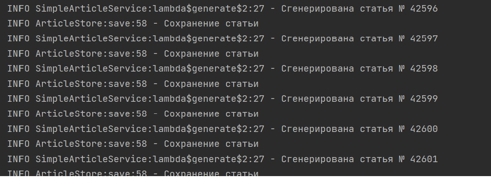
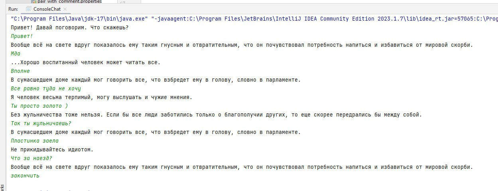

### job4j_articles

#### Описание
Проект "Генератор статей" - программа, которая генерирует статьи из слов в случайном порядке. Слова и статьи хранятся в базе данных <a href="http://hsqldb.org/">HQLDB</a>, хранимой в виде
файла.

### Стек технологий
Java 17, HSQLDB 2.5.1, Log4j 1.2.7

### Требования к окружению
Java 17, Maven 3.4.0

#### Запуск через терминал
<p>1. Собрать jar через Maven</p>

```bash
mvn install
```
<p>2. Запустить jar файл</p>

```bash
java -jar target/app.jar
```

#### Запуск через IDE

1. Перейте к папке ``src/main/java`` и файлу ``ru.job4j.articles.Application``
2. Нажать на кнопку запуска метода ``main`` в IDE

### Взаимодействие с приложением

#### Скриншоты

##### *Лог*



##### *Пример статьи*



### Контакты


- Telegram: [@OlgaIlyina0312](https://t.me/OlgaIlyina0312)
- Email:    [oliljina@mail.ru](oliljina@mail.ru)
